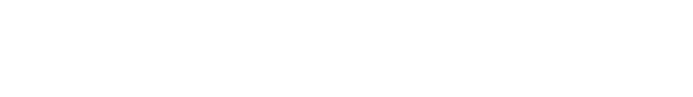

  

### Hi there, I'm Oshan J. Rupasinghe 👋

I'm a Full-Stack Software Engineering Undergraduate with a passion for Web-Application Development. 
I specialize in Frontend technologies like HTML, CSS, and JavaScript, creating beautiful and responsive user interfaces. 
On the Backend, I have expertise in PHP and MySQL Database, ensuring seamless data handling and processing. In addition to Web development, I excel in Cross-Platform Mobile Application Development using React-Native, creating efficient and engaging apps for various platforms. Another area of my expertise lies in Inventory Control System (POS) Desktop Applications Development, where I design intuitive and efficient systems for businesses. As an ethical hacking enthusiast, I've completed various hacking levels and hold certifications from both local and international institutions. My diverse skill set allows me to approach software development with a unique perspective, focusing not only on building robust applications but also on ensuring their security. Welcome to my GitHub portfolio, where you'll find a collection of my projects showcasing my skills and passion for software development. Let's build innovative solutions together!

### Reach me! 💬:

  &nbsp;&nbsp;&nbsp;&nbsp;&nbsp;&nbsp;Feel Free to Reach Me Any Time...

 

  
  &nbsp;
  
  &nbsp;
  
  &nbsp;
  
  &nbsp;
  
  &nbsp;
  
  &nbsp;
  
  &nbsp;
  
  &nbsp;
  

### Programming Languages & Tools 💻:

  
  &nbsp;
  
  &nbsp;
  
  &nbsp;
  
  &nbsp;
  
  &nbsp;
  
  &nbsp;
  
  &nbsp;
  
  &nbsp;
  
  <!-- &nbsp; -->
  
  <!-- &nbsp; --> 
  
  &nbsp;
  

  
  &nbsp;
  
  &nbsp;
  
  &nbsp;
  
  &nbsp;
  
  &nbsp;
  
  &nbsp;
  
  &nbsp;
  
  &nbsp;
  
  &nbsp;
  

### Support Me 🤝🫶:

 
&nbsp;&nbsp;&nbsp;&nbsp;&nbsp;&nbsp;&nbsp;

  

