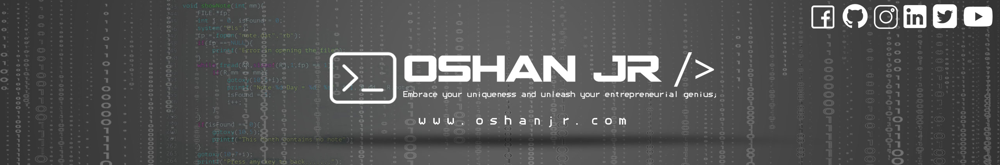

  
  
  <h1>Hi there, I'm Oshan J. Rupasinghe 👋</h1>
  <h3>Software Engineering & Cyber Security Undergrad | Full-Stack Developer | Bug Bounty Hunter</h3>
  
📍 Sri Lanka

  

    
  

  
  
  
  

---

### 👨‍💻 About Me

I blend full-stack development with a strong focus on application security. From crafting intuitive user interfaces to securing backend architecture, I approach software development with a unique, security-first perspective. 

- 🛡️ **Cyber Security:** Passionate about ethical hacking and actively hunting on platforms like **Intigriti** and **Bugcrowd**.
- 💻 **Tech Focus:** Web (PHP, MySQL, NextJs,ReactJs), Mobile (React-Native, Java), Desktop POS systems and AI.
- 🤝 **Let's connect:** Always open to building innovative, secure solutions together!

---

### 🛠️ Tech Stack & Tools

**Languages & Frameworks**

  
  
  
  
  
  

**Databases & Infrastructure**

  
  
  
  

**Design & Media**

  
  
  
  

---

### 🛡️ Bug Bounty & Security Journey

<table border="0">
  <tr>
    <td width="50%">
      

        
          
        
        
      

    </td>
    <td width="50%">
      <blockquote>
        🏆 <b>Latest Achievement:</b> 
          
        <i>Unlocked: Jan 18, 2026</i>
      </blockquote>
    </td>
  </tr>
</table>

---

### 📊 GitHub Stats

  
  

---

  <h3>Support Me 🤝🫶</h3>
  

